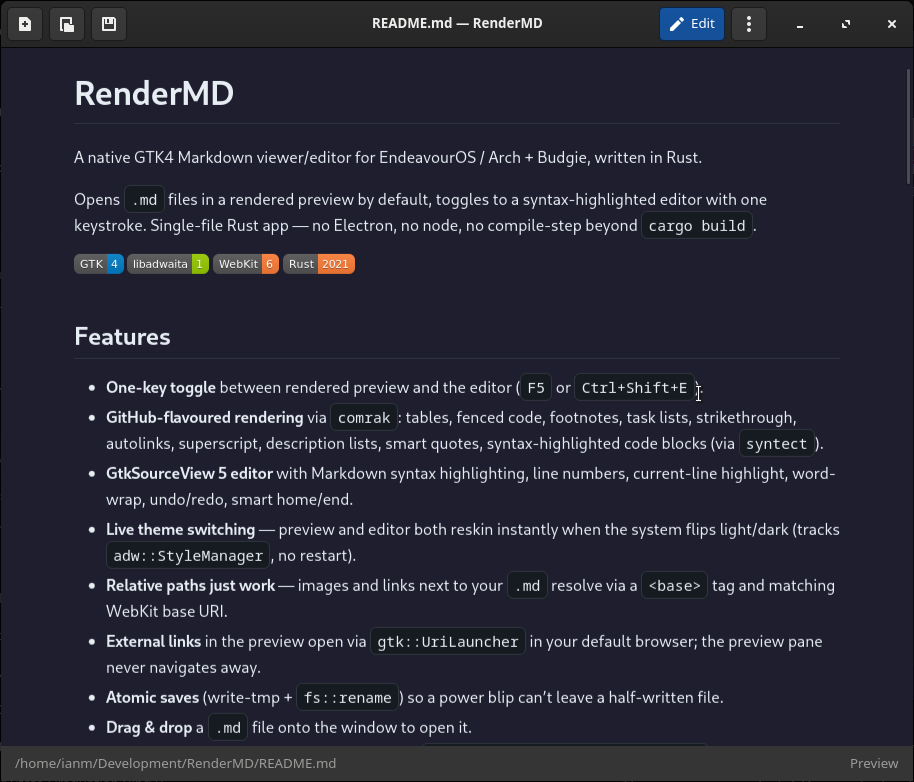

<p align="center">
  
</p>

<h1 align="center">RenderMD</h1>

<p align="center">
  A native GTK4 Markdown viewer/editor for EndeavourOS / Arch + Budgie,
  written in Rust.
</p>

<p align="center">
  
  
  
  
</p>

<p align="center">
  <a href="https://github.com/imcmurray/RenderMD/actions/workflows/build-deb.yml"></a>
  <a href="https://github.com/imcmurray/RenderMD/actions/workflows/build-rpm.yml"></a>
  <a href="https://github.com/imcmurray/RenderMD/actions/workflows/build-arch.yml"></a>
  <a href="https://github.com/imcmurray/RenderMD/actions/workflows/build-tarball.yml"></a>
</p>

Opens `.md` files in a rendered preview by default, toggles to a
syntax-highlighted editor with one keystroke. Single-file Rust app — no
Electron, no node, no compile-step beyond `cargo build`.



## Features

- **One-key toggle** between rendered preview and the editor (`F5` or
  `Ctrl+Shift+E`).
- **GitHub-flavoured rendering** via [`comrak`](https://crates.io/crates/comrak):
  tables, fenced code, footnotes, task lists, strikethrough, autolinks,
  superscript, description lists, smart quotes, syntax-highlighted code
  blocks (via `syntect`).
- **GtkSourceView 5 editor** with Markdown syntax highlighting, line numbers,
  current-line highlight, word-wrap, undo/redo, smart home/end.
- **Live theme switching** — preview and editor both reskin instantly when
  the system flips light/dark (tracks `adw::StyleManager`, no restart).
- **Relative paths just work** — images and links next to your `.md` resolve
  via a `<base>` tag and matching WebKit base URI.
- **External links** in the preview open via `gtk::UriLauncher` in your
  default browser; the preview pane never navigates away.
- **Atomic saves** (write-tmp + `fs::rename`) so a power blip can't leave a
  half-written file.
- **Drag & drop** a `.md` file onto the window to open it.
- **Window state** (size, maximized) persisted to
  `~/.config/rendermd/settings.ini`.
- **CLI**: `rendermd file.md` opens straight into preview;
  `rendermd` alone gives you a blank document in edit mode.

## Layout

```
src/main.rs                                                # the entire app (single file)
Cargo.toml                                                 # crate manifest
Cargo.lock                                                 # locked dep tree (checked in for reproducible builds)
rendermd                                                   # bash launcher; execs target/release/rendermd
io.github.rendermd.RenderMD.desktop                        # Budgie/GNOME menu entry + .md MIME association
setup.sh                                                   # build + install to ~/.local
data/icons/hicolor/scalable/apps/io.github.rendermd.*.svg  # app icon (registered with the GTK icon theme at startup)
docs/screenshot.png                                        # README screenshot
```

## Install

### 1. System libraries (Arch / EndeavourOS)

```bash
sudo pacman -S --needed \
    rust \
    gtk4 libadwaita gtksourceview5 webkitgtk-6.0 \
    glib2 hicolor-icon-theme
```

GTK4, libadwaita, GtkSourceView5 and WebKitGTK6 are dynamically linked at
runtime — `cargo build` finds them via `pkg-config`, and the binary
`dlopen`s them on launch.

### 2. Build and install

```bash
./setup.sh
```

That runs `cargo build --release` (first build pulls the gtk4-rs ecosystem
— expect 1–2 minutes), then installs everything to `~/.local`:

| Path                                                   | What                            |
| ------------------------------------------------------ | ------------------------------- |
| `~/.local/share/rendermd/rendermd-bin`                 | the binary                      |
| `~/.local/bin/rendermd`                                | launcher on `PATH`              |
| `~/.local/share/applications/io.github.rendermd.RenderMD.desktop` | menu entry + `.md` association |
| `~/.local/share/icons/hicolor/scalable/apps/io.github.rendermd.RenderMD.svg` | app icon |

It also generates PNG bitmaps at standard sizes (16/24/32/48/64/128/256),
writes a hicolor `index.theme` if you don't have one, runs
`update-desktop-database` and `gtk4-update-icon-cache`, and points
`xdg-mime` at the new entry so `.md` double-clicks open in RenderMD.
Budgie's menu picks it up under Office.

Flags:

- `./setup.sh --build-only` — skip the install (build only)
- `./setup.sh --no-mime`    — install but don't change the default `.md` opener

## Run

```bash
rendermd                    # if installed, anywhere on PATH
rendermd README.md

# or, before install / during dev:
./rendermd README.md        # the in-tree launcher uses target/release/rendermd
```

## Keyboard shortcuts

| Shortcut              | Action                |
| --------------------- | --------------------- |
| `F5` / `Ctrl+Shift+E` | Toggle Preview ↔ Edit |
| `Ctrl+N`              | New                   |
| `Ctrl+O`              | Open…                 |
| `Ctrl+S`              | Save                  |
| `Ctrl+Shift+S`        | Save As…              |
| `Ctrl+Z` / `Ctrl+Y`   | Undo / Redo           |
| `Ctrl+W` / `Ctrl+Q`   | Close / Quit          |
| `Ctrl+?`              | Shortcuts dialog      |

## Tech stack

- Rust 2021
- [`gtk4`](https://crates.io/crates/gtk4) — core widgets
- [`libadwaita`](https://crates.io/crates/libadwaita) (aliased to `adw`) —
  `Application`, `HeaderBar`, `ToolbarView`, `AlertDialog`, `AboutDialog`
- [`sourceview5`](https://crates.io/crates/sourceview5) — editor
- [`webkit6`](https://crates.io/crates/webkit6) — preview pane
- [`comrak`](https://crates.io/crates/comrak) (`syntect` feature) — Markdown
  → HTML + syntax highlighting

Feature flags pinned in `Cargo.toml`: `gtk4 v4_12`, `libadwaita v1_5`,
`sourceview5 v5_10`.

## Configuration

- Settings file: `~/.config/rendermd/settings.ini`
- App ID: `io.github.rendermd.RenderMD`

If you want to force dark mode globally:

```bash
gsettings set org.gnome.desktop.interface color-scheme prefer-dark
```

RenderMD picks it up live without restarting.

## License

MIT.
